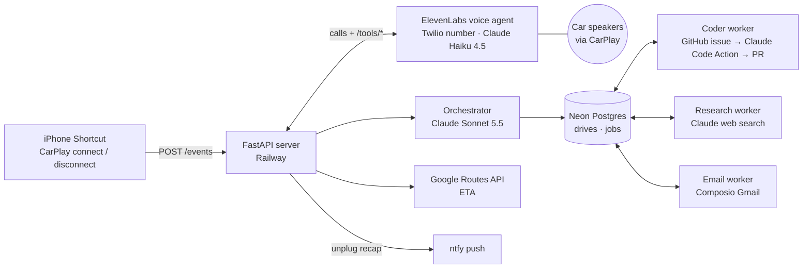

# Shotgun

**Everyone put a chatbot in the car. Shotgun is an agent built for the car.**

You get in your car.

You plug in. 

Before you've backed out, the dash lights up: SHOTGUN.
"North Campus, 22 minutes. Sarah's login bug is still open. Want me on it?"
"Yeah. Merge it if the tests pass."
You drive. It works. Three minutes out, the car rings again: "PR's merged. Tests are green. You're clear."

Your car finally has someone riding shotgun.
Plug in your phone and your car calls you. It knows you're heading out, and it knows how long you've got. Tell it what's on your mind. Quick questions get answered before you've left the lot. Bigger things, like a bug to fix or a pull request to ship, it takes off your hands and works on while you drive. Three minutes before you pull in, the car rings once more: here's what got done.
It never acts on anything you can't take back until you say "yes."

Shotgun is an AI agent saved as a phone contact. Plug your phone into the car and the car rings: you say what you need, it answers quick questions on the spot and hands longer jobs (fixing a bug and opening a pull request, research, sending an email) to background subagents. About 3 minutes before you arrive, the car rings once more with a summary. Nothing irreversible happens without a spoken "yes".

Built solo at MHacks 2026.

## Try it out

- **Demo video:** TODO: paste URL
- **Dashboard replay:** https://shotgun-production-5f30.up.railway.app/dashboard?mock=1 (a recorded drive: the call, the coding job, the PR and the arrival call, looping)
- **Code:** this repo

The phone line only answers the builder's number (caller allowlist), so the video and the replay are the way to see it run. The replay runs in your browser and never touches the server's phone line.

## How a drive works

1. **Plug in.** An iOS Shortcut ("When CarPlay connects") posts to the server, and the car rings: "Shotgun here. Where are we headed?"
2. **Talk.** Searches and drafts are answered on the call. Longer jobs are dispatched, and the agent asks for any "yes" up front ("Merge it if the tests pass?").
3. **Drive.** Workers run in parallel in the background.
4. **Arrive.** At ETA − 3 min the car rings once with a batched summary: done, waiting on you, failed. Unplugging closes the drive and sends a push recap.

## Architecture



- **Inline tools** (`search_web`, `draft_message`, `set_destination`) answer during the call in under 8 s.
- **Background tools** (`dispatch_task`, `get_status`, `approve_action`) answer in under 500 ms: they write a job row and return. Workers pick jobs up from the shared table; there is no agent-to-agent protocol.
- **At most two calls per drive:** departure and arrival, plus a rare exception call when a pre-approved action can't go ahead as agreed.

## Stack

| Layer | Tech |
| --- | --- |
| Trigger | iOS Shortcuts automation (CarPlay connect / disconnect) |
| Voice + phone | ElevenLabs Agents on a Twilio number, Claude Haiku 4.5 for voice turns |
| Orchestrator | Claude Sonnet 5.5 (Anthropic SDK, tool use) |
| Server | Python 3.12, FastAPI on Railway |
| Job table | Neon Postgres (psycopg 3) |
| Workers | Claude Code GitHub Action (coder), Claude web search (research), Composio Gmail (email) |
| Maps | Google Routes API (ETA once at departure) |
| Push | ntfy (unplug recap) |

## Repo layout

```
app/            FastAPI server: events, voice tools, orchestrator, calls, approvals, dashboard API
app/workers/    background workers (coder, research, email)
config/         ElevenLabs agent config and voice prompt
static/         mission-control dashboard (single HTML file)
scripts/        setup, deploy, demo and key-check helpers
tests/          offline test suite (live tests marked @live)
docs/           build plan, decisions log, Shortcut setup
```

## Run it

```bash
make setup        # uv + Python 3.12 + deps, git secret hook, creates .env
# fill in .env (see .env.example)
make check-keys   # verifies every key with a read-only call
make dev          # http://localhost:8000/health
make test lint
make deploy       # Railway
```

iPhone Shortcut setup: [docs/SHORTCUT_SETUP.md](docs/SHORTCUT_SETUP.md). `make help` lists every target.

## Run a demo from the terminal

```bash
make demo-reset     # before a rehearsal: restore the planted bug, close stale drives and jobs
make demo-call      # simulate the plug-in: the phone rings, same as plugging into CarPlay
make watch          # live terminal view of the drive, its jobs and calls
make demo-arrive    # ring the arrival call now instead of at ETA − 3 min (needs a job in the drive)
```

Dashboards: `/dashboard?mock=1` replays a recorded drive in the browser (local: `make dev`, then
http://localhost:8000/dashboard?mock=1). `/dashboard#token=<DASHBOARD_TOKEN>` is the live view.
If `demo-call` doesn't ring, the call policy skipped it (e.g. a call in the last 30 min): set
`CALL_POLICY=always` on the server for rehearsals.

## Safety

- Nothing irreversible (send, merge) without a spoken "yes", given at dispatch or on the arrival call. A result that breaks its pre-approval stops and triggers an exception call.
- `/events` and `/tools/*` check shared secrets, and the voice agent only serves allowlisted callers.
- No secrets in the repo: keys live in `.env` and Railway variables, and a pre-commit hook blocks key-shaped strings.

Build plan and decision log: [docs/PLAN.md](docs/PLAN.md), [docs/DECISIONS.md](docs/DECISIONS.md).
